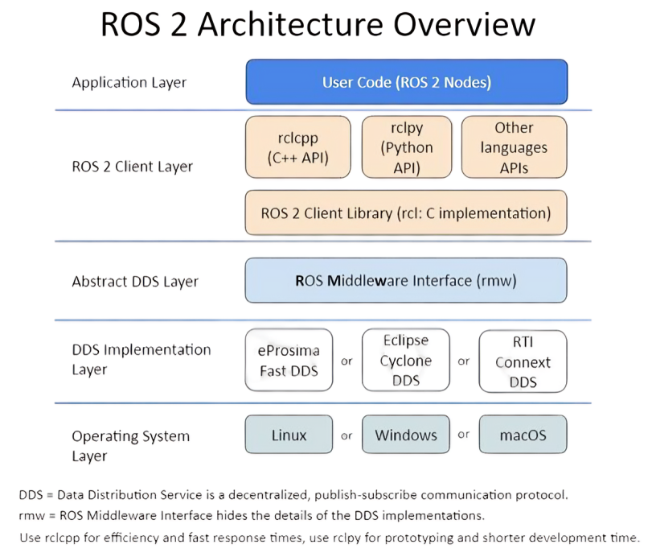

<figure style="text-align:center">
    
    <figcaption>Image Source <a href="https://automaticaddison.com/ros-2-architecture-overview/" target="_blank">Automatic Addison</a></figcaption>
</figure>

# ROS 2 Overview and Architecture

At the core of **ROS 2** (Robot Operating System 2) lies the **DDS middleware**, which facilitates message exchange between different nodes and the various applications running on the robot. This middleware forms the backbone of ROS 2 and, by extension, our robot. The ability to efficiently exchange messages is fundamental to the functioning of any robotic system that involves communication between multiple nodes.

## What is DDS?
**DDS** (Data Distribution Service) is an industrial-grade communication protocol that provides several key functionalities:
- **Node Discovery**: Enables nodes in a network to discover each other dynamically.
- **Message Serialization**: Converts messages into a standardized format for transmission.
- **Message Transport**: Handles the reliable transport of messages between nodes across a network.

DDS has been widely adopted in a range of industries—from finance to space exploration, and even in critical applications like railway transportation. Due to its **stability** and **robustness**, DDS is considered a **reliable protocol** that has been tailored to meet the needs of applications requiring secure and dependable communication.

## DDS Implementations for ROS 2
Because DDS is a well-established and trusted protocol, several organizations offer their own **DDS implementations**, each with varying features and optimizations. Since there is no one-size-fits-all solution that suits every robot or application scenario, ROS 2 was designed to support multiple DDS implementations. This flexibility allows developers to choose the DDS implementation that best fits their specific use case. Commonly used DDS implementations in ROS 2 include:
- **Cyclone DDS**
- **Fast DDS**
- **Connext DDS**

## ROS 2 Middleware (rmw)
Once the communication protocol (DDS) is selected, the **ROS 2 Middleware (rmw)** interface acts as the layer that connects ROS 2 applications with the chosen DDS implementation. The **rmw** is responsible for abstracting the underlying DDS details, allowing developers to focus on building higher-level robotic applications without needing to interact directly with DDS.

## ROS 2 Client Library
With the communication protocol and middleware in place, the **ROS 2 Client Library** provides the logic, core functionality, and APIs necessary for developing robot applications. This library, fully developed in **C and C++**, contains all the essential functions of ROS 2. These functions are made available to robotic software developers, enabling them to build applications that interact with the robot's hardware, sensors, and actuators.

To further enhance flexibility and usability, ROS 2 provides a set of **language bindings** that allow developers to use their preferred programming languages. These interfaces enable the usage of the ROS 2 Client Library with various programming languages, such as:
- **C++**
- **Python**
- **Rust**
- **Java**

These language bindings make ROS 2 accessible to a wider range of developers, as they can choose the language they are most comfortable with or the one most suited for their specific application.

## Key Aspects of ROS 2: Similarities to an Operating System
ROS 2 shares several core principles with traditional operating systems, enabling it to function as a robust framework for robotic applications. Four key aspects make ROS 2 similar to an operating system:

### 1. Hardware Abstraction
ROS 2 abstracts the hardware of the robot, providing a standard interface for accessing sensors, motors, and other peripherals. This allows developers to focus on building the functionality of the robot without worrying about specific hardware types or communication protocols. For example, ROS 2's `MoveIt2` library allows developers to focus on motion planning without having to handle the low-level details of the actuators.

### 2. Low-Level Device Control
Just as hardware manufacturers provide drivers to interface their hardware with an operating system, ROS 2 enables hardware manufacturers to offer device drivers for use within the framework. For instance, a camera manufacturer can provide a driver that enables ROS 2 applications to send commands to the camera, retrieve data, and visualize it in a unified way. This enables ROS 2 applications to seamlessly integrate with a wide range of devices.

### 3. Messaging Between Processes
In ROS 2, different processes, known as **nodes**, often run in parallel and communicate with each other. These nodes perform specific tasks, such as a robot planning a path to a goal while avoiding obstacles, and often rely on information from other nodes to perform their functions. Communication between these nodes in ROS 2 happens through three primary messaging protocols: **Topics**, **Services**, and **Actions**.

#### Topics (Publisher-Subscriber Model)
The **Topic** communication protocol follows the **publisher-subscriber** pattern. Here, nodes communicate by sending and receiving messages asynchronously via a channel, which is called a **topic**. 
- A **Publisher** node sends messages to a topic, and one or more **Subscriber** nodes can listen to that topic and receive the messages. 
- Multiple nodes can subscribe to the same topic, and a node can also be both a publisher and a subscriber. For example, a node can subscribe to data from one topic, process the data, and then publish the result to a different topic.
- **Topic channels** allow for **many-to-many communication**; multiple publishers can send messages to the same topic, and multiple subscribers can receive messages from the same topic. 
- There is no limit to the number of topics that can be created, as long as each topic has a unique name to identify it.
- A publisher can publish to multiple topics simultaneously, while a subscriber can listen to multiple topics at once.

This flexibility is particularly useful when handling data from sensors, where different nodes might need access to the same data stream. For example, a robot's camera node might publish visual data to a "camera/image" topic, and other nodes (e.g., an object detection node) can subscribe to this topic to receive and process the camera data in real time.

#### Services (Request-Response Model)
In the **Service** communication protocol, the interaction between nodes follows a **request-response** model. There are two primary roles:
- **Service Server**: A node that provides a specific service or functionality (e.g., performing a calculation or executing an algorithm).
- **Service Client**: A node that requests the functionality offered by the service server (e.g., asking for the result of the calculation).

The process works as follows:
- The **client node** sends a **request** message to the **server node**, asking it to perform a specific task or computation.
- The **server node** receives the request, processes it, and executes the necessary operations to fulfill the request (e.g., performing a computation or executing a robot movement).
- The **server node** then sends a **response** message back to the client, containing the result or outcome of the request.
- While the server is processing the request, the client can continue executing other tasks. This allows for more efficient resource utilization and avoids blocking the client's execution.

**Services** are ideal for short-duration tasks where a client waits for the result to continue its operation. For example, a service could be used to request the status of a robot's motor (e.g., "Is the motor on?").

#### Actions (Goal-Feedback-Result Model)
The **Action** communication protocol is designed for tasks that take longer to complete and require **continuous feedback** from the server. It is similar to services but differs in that it allows for **goal-oriented, long-running tasks** and provides feedback on the task's progress. There are two roles in this protocol:
- **Action Server**: A node that offers an action, typically involving a long-running task (e.g., navigating the robot from one point to another).
- **Action Client**: A node that requests the execution of an action (e.g., commanding the robot to move from point A to point B).

The interaction proceeds as follows:
- The **client node** sends a **goal message** to the **action server**, specifying the task that should be performed. For example, the goal might be the robot's destination or a desired configuration.
- The **action server** begins processing the goal and performs the necessary operations, such as navigating to the destination.
- **Feedback**: During the execution of the action, the action server periodically sends **feedback messages** to the client to provide updates on the status of the task. For example, if the action is navigation, feedback might include information about the robot's current position and progress toward the goal.
- **Result**: Once the action is completed, the action server sends a **result message** to the client, indicating whether the goal was successfully achieved or not.
- **Cancellation**: Unlike services, actions allow the client to cancel a task before it is completed. If the client decides to abort the action or if the goal changes, it can send a **cancel message** to the action server. The action server will stop executing and return a result message indicating that the action was aborted.

Actions are ideal for long-running tasks that require real-time feedback. For example, a robot’s navigation system might use actions to move to a goal, providing feedback on its progress and allowing the user to cancel or modify the navigation task if needed.

### Summary of Messaging Protocols
- **Topics** are used for asynchronous, many-to-many communication, where publishers send messages to a channel that subscribers listen to. Ideal for real-time data streaming.
- **Services** implement a request-response model, suitable for short, synchronous tasks where a client waits for the server’s response.
- **Actions** are used for long-running tasks, with continuous feedback and the possibility for task cancellation, making them perfect for processes that take time, like robot navigation.

These messaging protocols allow nodes to communicate in different ways depending on the nature of the task, making ROS 2 highly flexible and capable of supporting a wide range of robotic applications.

### 4. Package

 Management
ROS 2 allows developers to modularize the robot's functionality into different **packages**, which promotes code reusability, maintainability, and modularity. Each package focuses on implementing a specific functionality for the robot, and different packages can be reused across different robotic systems.

For example, if you've developed a **mobile robot**, you can create separate packages for different functionalities like **navigation**, **control**, or **vision**. If you later decide to work on an **autonomous drone**, you can reuse certain packages (such as navigation or mapping) as long as both the mobile robot and drone use the same sensors.

A ROS 2 package may include:
- **Description**
- **Simulation**
- **Control**
- **Vision**
- **Kinematics**
- **Voice Recognition**

## Architecture of ROS 2 Applications
- **Underlay**: The folder where all the default ROS 2 applications and packages are installed, typically found at `/opt/ros/<ros-distro>/`.
- **Overlay**: A custom folder for your personal ROS 2 packages and applications. The overlay folder has access to both the default ROS 2 packages and your custom packages. In case of name collisions, the version in the overlay folder takes priority.

```
.
├── workspace
│   ├── package
│       ├── node 1
│       ├── node 2
│       ├── launch files
│       └── configuration files
```

### Summary
In summary, ROS 2 combines DDS middleware, a flexible client library, and robust message-passing protocols to form a highly scalable and adaptable framework for developing robotic applications. Its key features—such as hardware abstraction, low-level device control, messaging between nodes, and modular package management—make it highly versatile and comparable to an operating system for robots. The ability to choose from multiple DDS implementations and leverage multiple programming languages further enhances its utility and accessibility for developers. Through this architecture, ROS 2 enables the seamless integration of various robotic systems, streamlining the development of complex robotic functionalities.