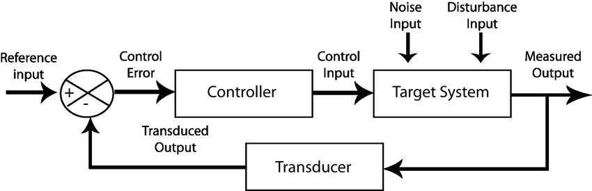
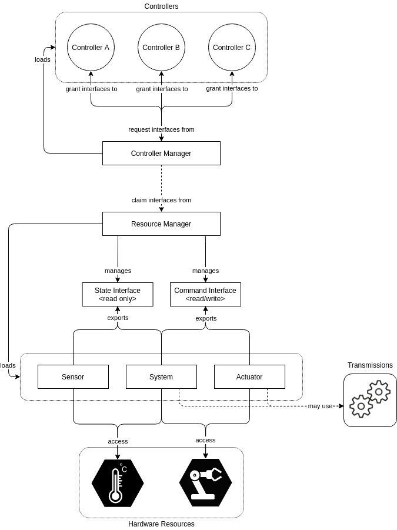

# Control Systems in Robotics

Control systems are fundamental in robotics, as they involve sending commands to actuators and ensuring that the system responds correctly, matching the desired movement. The field of control theory is dedicated to developing the mathematics and algorithms for creating components called **controllers**. A **controller** is a device or software component that directs a system based on feedback and control signals.

### The Role of Controllers in Robotics

A controller’s main goal is to implement a logic that activates a system (e.g., a motor) according to input variables. These variables represent desired goals. For instance, consider the example of a motor where we want to rotate it to a certain position. If we set the input goal to a position of **90 degrees**, the controller will compare the current position (the output) to this input value.

1. **Error Calculation**: The difference between the current state (output) and the desired state (input) is called **error**. 
   - If the motor is at 0 degrees (output), and the goal is 90 degrees (input), the error is **90 degrees**.
   - The controller then calculates the necessary command to minimize this error, guiding the motor to the desired position.

2. **Action and Feedback Loop**: Once the motor receives the command, it begins to move. As it approaches the target position, the error reduces and the controller adjusts the command accordingly to minimize further errors. When the motor reaches the goal (90 degrees), the output matches the input, and the error becomes zero.

This feedback process is fundamental to controlling various robotic systems, whether it be manipulators, mobile robots, or drones. Managing this feedback loop efficiently is crucial for precise and accurate robotic movements.

<figure style="text-align:center">
    
    <figcaption>Image Source <a href="https://www.researchgate.net/figure/Classical-block-diagram-of-a-single-input-single-output-SISO-feedback-control-system_fig1_277074204" target="_blank">ResearchGate</a></figcaption>
</figure>

---

## ROS 2 Control Framework

In the ROS 2 (Robot Operating System 2) ecosystem, **ros2control** is an essential framework designed to handle the control problem for robots. The framework addresses how commands are sent to actuators and how feedback from sensors (on actuator states such as position and velocity) is processed.

### Hardware Resources

At the core of **ros2control**, there are **hardware resources** which represent components that interact with the robot’s hardware, such as actuators and sensors:
- **Actuators**: Devices that perform actions, like motors or servos.
- **Sensors**: Devices that provide feedback about the actuators’ states, such as position or velocity sensors.
- A **hardware resource** can also represent a more complex system involving multiple actuators and sensors, either in real robots or in simulated environments like **Gazebo**.

These hardware resources interact with the control system through specific interfaces, namely:

- **Command Interface**: Used for sending (writing) commands to hardware (e.g., instructing a motor to move to a certain position).
- **State Interface**: Used for receiving (reading) information about the current state of the hardware (e.g., current position or speed of the motor).

---

### Resource Manager

A key component in **ros2control** is the **Resource Manager**. This abstraction layer allows easy management and interaction with hardware resources without having to write new drivers for each component. The Resource Manager facilitates the reuse of existing hardware components and makes them available for use by other control components.

It acts as a middleware between the physical hardware and the control systems, enabling the loading of hardware components that can then be accessed by other parts of the system, such as the controller manager.

---

### Controller Manager

The **Controller Manager** is another crucial component in **ros2control**. It manages the controllers that implement the specific control logic for hardware components. The controller manager can load and manage multiple controllers simultaneously, each with different control algorithms (e.g., for controlling motors, joints, or even entire robotic systems).

#### Key Functions of the Controller Manager:
1. **Control Logic**: Each controller is responsible for the control logic that ensures the robot’s actuators follow the desired commands, aiming to minimize the error between the desired and actual states.
2. **User Interaction**: Through the controller manager, users can interact with the system, for example, by listing available controllers, loading new controllers, or even obtaining the status of hardware components via command-line interfaces or ROS 2 services.
3. **Interface to ROS 2 Applications**: The controller manager also allows other ROS 2 nodes and applications to access hardware states and actuate hardware through services and topics.

<figure style="text-align:center">
    
    <figcaption>Image Source <a href="https://control.ros.org/rolling/doc/getting_started/getting_started.html" target="_blank">ROSCon Workshop</a></figcaption>
</figure>

---

### ROS 2 Controllers Library

In addition to creating custom controllers, **ros2control** also integrates with the **ros2controllers** library, which offers predefined controllers for common robotic applications. For example, there are controllers for moving differential drive robots, controlling arms, or any other specific hardware with common control strategies already implemented.

These existing controllers can be loaded into the controller manager to implement the required control logic quickly, ensuring both ease of use and efficiency in robot development.

---

### Summary

To summarize, ROS 2's **ros2control** framework offers a structured approach to managing robotic hardware through the use of hardware resources, resource managers, and controller managers. It simplifies the process of sending commands to actuators and receiving feedback from sensors, all while ensuring that robot movements remain as accurate as possible. By leveraging both custom and predefined controllers, users can control complex robotic systems and achieve precise movement with minimal effort.
